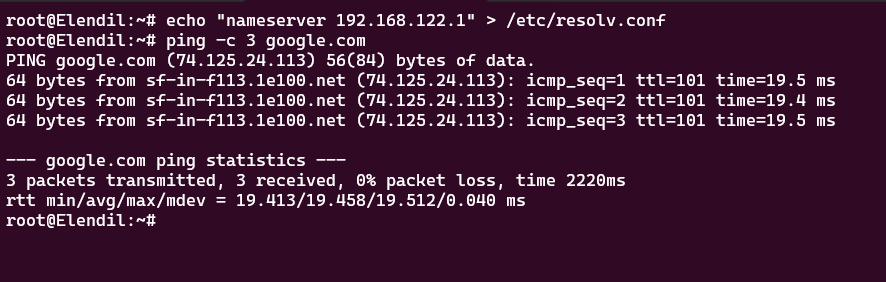

# Jarkom-Modul-3-2025-K44
No  | Nama                  | NRP 
--- | ----                  | ---
1   | Ahmad Yazid Arifuddin | 5027241040
2   | Tiara Fatimah Azzahra | 5027241090

## Soal 1

# Node DURIN
```
auto lo
iface lo inet loopback
    up echo nameserver 192.168.122.1 > /etc/resolv.conf

auto eth0
iface eth0 inet dhcp

auto eth1
iface eth1 inet static
    address 192.233.1.1
    netmask 255.255.255.0

auto eth2
iface eth2 inet static
    address 192.233.2.1
    netmask 255.255.255.0

auto eth3
iface eth3 inet static
    address 192.233.3.1
    netmask 255.255.255.0

auto eth4
iface eth4 inet static
    address 192.233.4.1
    netmask 255.255.255.0

auto eth5
iface eth5 inet static
    address 192.233.5.1
    netmask 255.255.255.0


```

# Node ELENDIL 
```
auto eth0
iface eth0 inet static
    address 192.233.1.2
    netmask 255.255.255.0
    gateway 192.233.1.1
    up echo nameserver 192.168.122.1 > /etc/resolv.conf
```

# Node ISILDUR 
```
auto eth0
iface eth0 inet static
    address 192.233.1.3
    netmask 255.255.255.0
    gateway 192.233.1.1
    up echo nameserver 192.168.122.1 > /etc/resolv.conf
```


# Node ANARION
```
auto eth0
iface eth0 inet static
    address 192.233.1.4
    netmask 255.255.255.0
    gateway 192.233.1.1
    up echo nameserver 192.168.122.1 > /etc/resolv.conf

```

# Node MIRIEL 
```
auto eth0
iface eth0 inet static
    address 192.233.1.5
    netmask 255.255.255.0
    gateway 192.233.1.1
    up echo nameserver 192.168.122.1 > /etc/resolv.conf

```

# Node AMANDIL 
```
auto eth0
iface eth0 inet dhcp
    up echo nameserver 192.168.122.1 > /etc/resolv.conf

```

# Node ELROS 
```
auto eth0
iface eth0 inet static
    address 192.233.1.7
    netmask 255.255.255.0
    gateway 192.233.1.1
    up echo nameserver 192.168.122.1 > /etc/resolv.conf


```

# Node GILGALAD 
```
auto eth0
iface eth0 inet dhcp
    up echo nameserver 192.168.122.1 > /etc/resolv.conf

```

# Node CELEBRIMBOR 
``` 
auto eth0
iface eth0 inet static
    address 192.233.2.3
    netmask 255.255.255.0
    gateway 192.233.2.1
    up echo nameserver 192.168.122.1 > /etc/resolv.conf

``` 

# Node PHARAZON 
```
auto eth0
iface eth0 inet static
    address 192.233.2.4
    netmask 255.255.255.0
    gateway 192.233.2.1
    up echo nameserver 192.168.122.1 > /etc/resolv.conf


```

# Node GALADRIEL 

```
auto eth0
iface eth0 inet static
    address 192.233.2.5
    netmask 255.255.255.0
    gateway 192.233.2.1
    up echo nameserver 192.168.122.1 > /etc/resolv.conf

```

# Node CELEBORN 
```
auto eth0
iface eth0 inet static
    address 192.233.2.6
    netmask 255.255.255.0
    gateway 192.233.2.1
    up echo nameserver 192.168.122.1 > /etc/resolv.conf

```

# Node OROPHER
```
auto eth0
iface eth0 inet static
    address 192.233.2.7
    netmask 255.255.255.0
    gateway 192.233.2.1
    up echo nameserver 192.168.122.1 > /etc/resolv.conf

``` 

# Node KHAMUL (Client-Addres-Fixed)
```
auto eth0
iface eth0 inet dhcp
  hwaddress ether 02:42:73:85:ce:00
    up echo nameserver 192.168.122.1 > /etc/resolv.conf 

```

# Node ERENDIS
```
auto eth0
iface eth0 inet static
    address 192.233.3.3
    netmask 255.255.255.0
    gateway 192.233.3.1
    up echo nameserver 192.168.122.1 > /etc/resolv.conf

```

# Node AMDIR 
``` 
auto eth0
iface eth0 inet static
    address 192.233.3.4
    netmask 255.255.255.0
    gateway 192.233.3.1
    up echo nameserver 192.168.122.1 > /etc/resolv.conf


```

# Node ALDARION 
```
auto eth0
iface eth0 inet static
    address 192.233.4.2
    netmask 255.255.255.0
    gateway 192.233.4.1
    up echo nameserver 192.168.122.1 > /etc/resolv.conf

```

# Node PALANTIR 
```
auto eth0
iface eth0 inet static
    address 192.233.4.3
    netmask 255.255.255.0
    gateway 192.233.4.1
    up echo nameserver 192.168.122.1 > /etc/resolv.conf

``` 

# Node NARVI 
```
auto eth0
iface eth0 inet static
    address 192.233.4.4
    netmask 255.255.255.0
    gateway 192.233.4.1
    up echo nameserver 192.168.122.1 > /etc/resolv.conf

``` 

# Node MINASTIR 

``` 
auto eth0
iface eth0 inet static
    address 192.233.5.2
    netmask 255.255.255.0
    gateway 192.233.5.1
    up echo nameserver 192.168.122.1 > /etc/resolv.conf

``` 

# Setup `nameserver` di seluruh node
```
echo "nameserver 192.168.122.1" > /etc/resolv.conf
```

# Test Seluruh Node
``` 
apt-get update
apt-get install -y nano dnsutils lynx htop curl apache2-utils
```

# Validasi
``` 
ping -c 3 8.8.8.8
ping -c 3 google.com

``` 




## Soal 2
## Soal 3
## Soal 4
## Soal 5
## Soal 6
## Soal 7
## Soal 8
## Soal 9
## Soal 10
## Soal 11
## Soal 12
## Soal 13
## Soal 14
## Soal 15
## Soal 16
## Soal 17
## Soal 18
## Soal 19
## Soal 20
